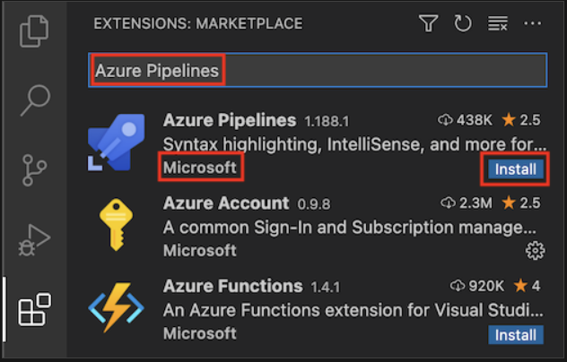

# Reference 
https://learn.microsoft.com/en-us/training/modules/build-first-bicep-deployment-pipeline-using-azure-pipelines/
https://learn.microsoft.com/en-us/azure/azure-functions/functions-create-first-function-bicep?tabs=CLI
https://github.com/azure-samples/azure-sql-binding-func-dotnet-todo/tree/main/

## 1 Prerequisites 

### 1.1 Install the Azure Pipelines extension

Microsoft publishes an Azure Pipelines extension for Visual Studio Code. The extension can help you write pipeline YAML files. It's a good idea to install this extension, so your YAML files are validated as you work.

1. In Visual Studio Code, select View > Extensions (shortcut is Ctrl+Shift+x).

1. In the Search box, enter Azure Pipelines, and then select the Azure Pipelines extension published by Microsoft. Select Install.



## 2 Create a project in Azure DevOps

1. In a browser, go to dev.azure.com. Sign in or create a new account.
1. If you created a new account, follow the prompts to create an Azure DevOps organization. Azure DevOps then prompts you to create a new project. Continue to the next step to set up the project.If you signed in to an existing Azure DevOps organization, select New project to create a new project.
1. In the Create a project to get started pane, enter the following details for your new project:

* Project name: Use a meaningful but short name. For this exercise, enter `AzureSamples`.
* Description: Enter a description of the project's purpose. For this exercise, enter `AzureSamples`.
* Visibility: You can use Azure DevOps to create public and private repositories. In this case, the repository should be private because your company website files should be accessed only by people within your organization. You can grant access to other users later.


## 3 Create Service connection

## 4 Create a resource group in Azure

1. In the Visual Studio Code terminal, run the following command to sign in to Azure:

    ```azurecli
    az login
    ```

1. From the Cloud Shell, to list the regions that are available from your Azure subscription, run the following az account list-locations command.

    ```azurecli
    az account list-locations \
       --query "[].{Name: name, DisplayName: displayName}" \
       --output table
    ```

1. From the Name column in the output, select a region that's close to you.
1. Run az configure to set your default region. Replace <REGION> with the name of the region you selected. 

    ```azurecli
    az configure --defaults location=<REGION>
    ```
1. This example sets australiasoutheast as the default region:

    ```azurecli
    az configure --defaults location=australiasoutheast
    ```

1. Use a `az group create` command to create a resource group named *azure-samples-rg*.

    ```azurecli
    az group create --name azure-samples-rg --location australiasoutheast
    ```

## 5 Add Bicep file to create the resources

1. Open the Visual Studio Code Explorer.

1. In the deploy folder, create a new file named main.bicep.

1. Copy the following code into the main.bicep file:

    ```code
    @description('The Azure region into which the resources should be deployed.')
    param location string = resourceGroup().location

    @description('The type of environment. This must be nonprod or prod.')
    @allowed([
    'nonprod'
    'prod'
    ])
    param environmentType string

    @description('Indicates whether to deploy the storage account')
    param deployStorageAccount bool

    @description('A unique suffix to add to resource names that need to be globally unique.')
    @maxLength(13)
    param resourceNameSuffix string = uniqueString(resourceGroup().id)

    var appServiceAppName = 'azure-samples-${resourceNameSuffix}'
    var appServicePlanName = 'azure-samples-plan'
    var azureSamplesStorageAccountName = 'azuresamples${resourceNameSuffix}'

    // Define the SKUs for each component based on the environment type.
    var environmentConfigurationMap = {
    nonprod: {
        appServicePlan: {
        sku: {
            name: 'F1'
            capacity: 1
        }
        }
        azureSamplesStorageAccount: {
        sku: {
            name: 'Standard_LRS'
        }
        }
    }
    prod: {
        appServicePlan: {
        sku: {
            name: 'S1'
            capacity: 2
        }
        }
        azureSamplesStorageAccount: {
        sku: {
            name: 'Standard_ZRS'
        }
        }
    }
    }

    var azureSamplesStorageAccountConnectionString = deployStorageAccount ? 'DefaultEndpointsProtocol=https;AccountName=${azureSamplesStorageAccount.name};EndpointSuffix=${environment().suffixes.storage};AccountKey=${azureSamplesStorageAccount.listKeys().keys[0].value}' : ''

    resource appServicePlan 'Microsoft.Web/serverfarms@2022-03-01' = {
    name: appServicePlanName
    location: location
    sku: environmentConfigurationMap[environmentType].appServicePlan.sku
    }

    resource appServiceApp 'Microsoft.Web/sites@2022-03-01' = {
    name: appServiceAppName
    location: location
    properties: {
        serverFarmId: appServicePlan.id
        httpsOnly: true
        siteConfig: {
        appSettings: [
            {
            name: 'AzureSamplesStorageAccountConnectionString'
            value: azureSamplesStorageAccountConnectionString
            }
        ]
        }
    }
    }

    resource azureSamplesStorageAccount 'Microsoft.Storage/storageAccounts@2022-09-01' = if (deployStorageAccount) {
    name: azureSamplesStorageAccountName
    location: location
    kind: 'StorageV2'
    sku: environmentConfigurationMap[environmentType].azureSamplesStorageAccount.sku
    }

    ```

1. Save your changes to the file.

1. In the Visual Studio Code terminal, run this code to stage the changes, commit the changes, and push the changes to your repository.

    ```code
    git add deploy/main.bicep
    git commit -m 'Add Bicep file'
    git push
    ```

## 6 Create a YAML pipeline definition

1. In Visual Studio Code, open the Explorer.

1. In Explorer, hover over your project folder, and select New Folder. Name that folder `.pipelines`.

1. Select the `.pipelines` folder, and in the project select New File icon. Name that file `azure-pipelines.yml`.
1. The YML file is open in the main panel. Paste the following pipeline definition code into the file:

    ```code
    trigger: none

    pool:
    vmImage: ubuntu-latest

    variables:
    - name: deploymentDefaultLocation
    value: australiasoutheast

    jobs:
    - job:
    steps:

    - task: AzureResourceManagerTemplateDeployment@3
        inputs:
        connectedServiceName: $(ServiceConnectionName)
        deploymentName: $(Build.BuildNumber)
        location: $(deploymentDefaultLocation)
        resourceGroupName: $(ResourceGroupName)
        csmFile: deploy/main.bicep
        overrideParameters: >
            -environmentType $(EnvironmentType)
    ```

1. Save your changes to the file.

1. To commit and push the azure-pipelines.yml file to your Git repository, paste this code in the terminal panel, and then press Enter.

    ```code
    git add .pipelines/azure-pipelines.yml
    git commit -m "Add pipeline definition"
    git push
    ```

## 7 Set up the pipeline in Azure Pipelines

1. Go to **Pipelines**, and then select **New pipeline**.

1. Do the steps of the wizard by first selecting **GitHub** as the location of your source code.

1. You might be redirected to GitHub to sign in. If so, enter your GitHub credentials.

1. When you see the list of repositories, select your repository.

1. You might be redirected to GitHub to install the Azure Pipelines app. If so, select **Approve & install**.

1. When the **Configure** tab appears, select `.pipelines/azure-pipelines.yml`.

## 9 Add pipeline variables

1. In Azure DevOps, go to your project.

1. Under Pipelines, select Library.

1. Select + Variable group.

1. Under Properties, enter **Release** for the variable group name.

1. Add the following variables - 

    |Variable name  | Value  |
    |---------|---------|
    |ServiceConnectionName     |    AzureSamples     |
    |ResourceGroupName     |    azure-samples-rg     |
    |EnvironmentType     |    nonprod     |
    |DeployStorageAccount     |    true     |
